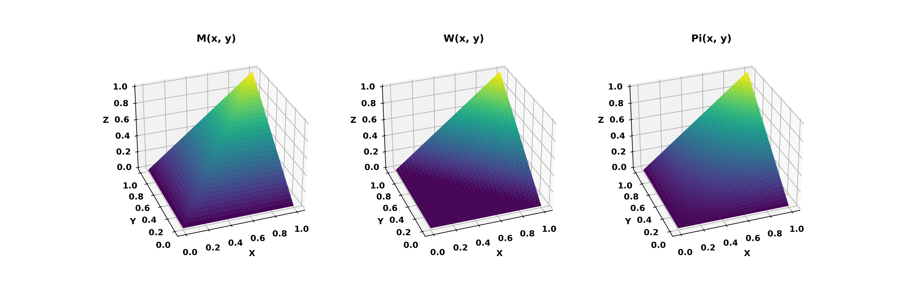

# MSR_Frechet_Bounds
Plots the three copula functions: maximum (M(x,y)), minimum (W(x,y)) and product (P(x,y)).

```python
#works on numpy 1.25.2 and matplotlib 3.8.0
import numpy as np
import matplotlib.pyplot as plt
from mpl_toolkits.mplot3d import Axes3D

x = np.arange(0, 1.01, 0.01)
y = np.arange(0, 1.01, 0.01)

x, y = np.meshgrid(x, y)

m = np.minimum(x, y)
w = np.maximum(x + y - 1, 0)
pi = x * y

fig = plt.figure(figsize=(15, 5))
elev, azim = 30, -110

ax = fig.add_subplot(131, projection='3d')
ax.plot_surface(x, y, m, cmap='viridis')
ax.set_xlabel('X')
ax.set_ylabel('Y')
ax.set_zlabel('Z')
ax.set_title('M(x, y)')
ax.view_init(elev=elev, azim=azim)

ax = fig.add_subplot(132, projection='3d')
ax.plot_surface(x, y, w, cmap='viridis')
ax.set_xlabel('X')
ax.set_ylabel('Y')
ax.set_zlabel('Z')
ax.set_title('W(x, y)')
ax.view_init(elev=elev, azim=azim)

ax = fig.add_subplot(133, projection='3d')
ax.plot_surface(x, y, pi, cmap='viridis')
ax.set_xlabel('X')
ax.set_ylabel('Y')
ax.set_zlabel('Z')
ax.set_title('Pi(x, y)')
ax.view_init(elev=elev, azim=azim)

plt.show()
```
