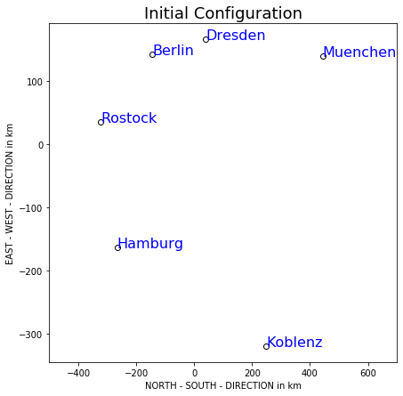

# MVAMDScity1
Computes the map of the cities by application of multidimensional scaling.

```python
import numpy as np
import matplotlib.pyplot as plt

ber  = [0, 214, 279, 610, 596, 237]
dre  = [214, 0, 492, 533, 496, 444]
ham  = [279, 492, 0, 520, 772, 140]
kob  = [610, 533, 520, 0, 521, 687]
mue  = [596, 496, 772, 521, 0, 771]
ros  = [237, 444, 140, 687, 771, 0]

dist = np.array([ber, dre, ham, kob, mue, ros])

a = (dist**2) * (-0.5)
i = np.diag([1]*6)
u = [1]*6
u = np.reshape(u, (6, 1))
h = i - (1/6 * (u @ u.T))
b = h @ a @ h
e = np.linalg.eig(b)
x = e[1] @ np.diag(e[0])**0.5

cities = ["Berlin", "Dresden", "Hamburg", "Koblenz", "Muenchen", "Rostock"]


fig, ax = plt.subplots(figsize = (7, 7))
ax.scatter(x[:, 0], x[:, 1], c = "w", edgecolor = "k")
for i in range(len(cities)):
    ax.text(x[i, 0], x[i, 1], cities[i], c = "b", fontsize = 16)

ax.set_xlim(-500, 700)

ax.set_ylabel("EAST - WEST - DIRECTION in km")
ax.set_xlabel("NORTH - SOUTH - DIRECTION in km")

plt.title("Initial Configuration", fontsize = 18)

plt.show()
```
