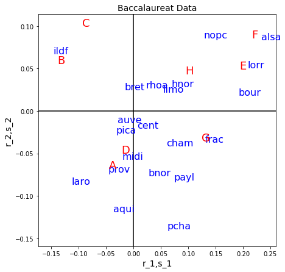

# MVAcorrbac
Performs a correspondence analysis for the baccalaureat data, shows the eigenvalues of the singular value decomposition of the chi-matrix and displays graphically its factorial decomposition.

```python
import pandas as pd
import numpy as np
import matplotlib.pyplot as plt


x1 = pd.read_csv("bac.dat", sep = "\s+", header=None)
x1 = x1.iloc[:, 1:len(x1.columns)]
wcors = 0  # set to 0/1 to ex/include Corsica
wcorsica = [1] * (len(x1)-1) + [wcors]    
x = x1.iloc[[i for i, x in enumerate(wcorsica) if x == 1], :]
a = x.sum(axis = 1)
b = x.sum(axis = 0)
e = np.reshape(np.array(a), (len(a), -1)) @ (np.reshape(np.array(b), (-1, len(b)))/sum(a))

# chi-matrix
cc = (x - e)/np.sqrt(e)

g, l, d = np.linalg.svd(cc, full_matrices = False)
ll = l**2 #eigenvalues
aux = np.cumsum(ll)/sum(ll)
perc = np.vstack((ll, aux))
r1 = np.multiply(np.tile(l, (g.shape[0], 1)), g)
r = r1/np.tile(np.reshape(np.array(np.sqrt(a)), (len(a), -1)), (1, g.shape[1]))
s1 = np.multiply(np.tile(l, (d.shape[0], 1)), d.T)
s = s1/np.tile(np.reshape(np.array(np.sqrt(b)), (len(b), -1)), (1, d.shape[1]))

# contribution in r
car = np.tile(np.reshape(np.array(a), (len(a), -1)), (1, r.shape[1])) \
    * r**2/np.tile(np.reshape(np.array(ll), (len(ll), -1)), (1, r.shape[0])).T

# contribution in s
cas = np.tile(np.reshape(np.array(b), (len(b), -1)), (1, s.shape[1])) \
    * s**2/np.tile(np.reshape(np.array(ll), (len(ll), -1)), (1, s.shape[0])).T
    
types   = ["A", "B", "C", "D", "E", "F", "G", "H"]

regions = ["ildf", "cham", "pica", "hnor", "cent", "bnor", "bour", "nopc", 
           "lorr", "alsa", "frac", "payl", "bret", "pcha", "aqui", "midi", 
           "limo", "rhoa", "auve", "laro", "prov"]

if wcors == 1:
    regions += ["cors"]
    
fig, ax = plt.subplots(figsize = (7, 7))
ax.scatter(r[:, 0], r[:, 1], c = "w")
ax.scatter(s[:, 0], s[:, 1], c = "w")

for i in range(len(regions)):
    ax.text(r[i, 0], r[i, 1], regions[i], c = "b", fontsize = 16)
    
for i in range(len(types)):
    ax.text(s[i, 0], s[i, 1], types[i], c = "r", fontsize = 18)
    
ax.axvline(0, c = "k")
ax.axhline(0, c = "k")

plt.title("Baccalaureat Data", fontsize = 14)
ax.set_xlabel("r_1,s_1", fontsize = 14)
ax.set_ylabel("r_2,s_2", fontsize = 14)

plt.show()
```
