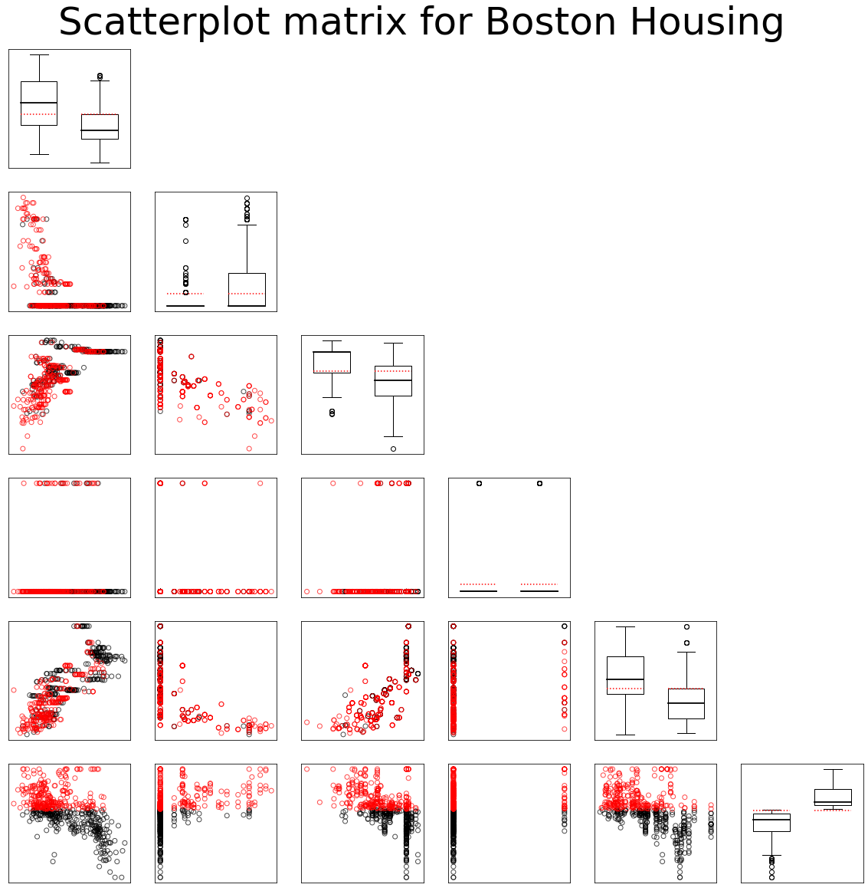

# MVAdrafthousingt
Plots the scatterplot matrix for the transformed Boston housing data variables X1,
... , X5 and X14.

```python
#works on pandas 1.5.2, numpy 1.23.5 and matplotlib 3.6.2
import pandas as pd
import numpy as np
import matplotlib.pyplot as plt

df = pd.read_csv('bostonh.dat', sep='\s+', header=None, names=np.arange(1,15,1))

df["name"] = df[14]
df = df.loc[:,[1,2,3,4,5,14,"name"]]
df.rename(columns={14: 6}, inplace= True)
df.loc[:,[1,3,5,6]] = np.log(df.loc[:,[1,3,5,6]])
df[2] = df[2]/10
df.loc[df["name"] <= df["name"].median(), ["name"]] = 1
df.loc[df["name"] > df["name"].median(), ["name"]] = 2

fig, axs = plt.subplots(6,6, figsize=(20,20))

for i in range(6):
    for j in range(6):
        if i == j:
            axs[i,j].boxplot([df.loc[df["name"] == 1,i+1], df.loc[df["name"] == 2,i+1]],
                             widths = 0.6, medianprops = dict(color="black",linewidth=1.8))
            axs[i, j].plot([0.7, 1.3], [np.mean(df[i+1]),np.mean(df[i+1])], linestyle="dotted", linewidth=1.5, color="red")
            axs[i, j].plot([1.7, 2.3], [np.mean(df[i+1]),np.mean(df[i+1])], linestyle="dotted", linewidth=1.5, color="red")
            axs[i, j].set_xticks([])
            axs[i, j].set_yticks([])
        
        if i > j:    
            axs[i,j].scatter(df.loc[df["name"] == 1,j+1],df.loc[df["name"] == 1,i+1], 
                             alpha = 0.7, facecolors='none', edgecolors='black')
            axs[i,j].scatter(df.loc[df["name"] == 2,j+1],df.loc[df["name"] == 2,i+1], 
                             alpha = 0.7, facecolors='none', edgecolors='r')
            axs[i, j].set_xticks([])
            axs[i, j].set_yticks([])
        
        if j > i:
            axs[i, j].axis("off")
            
fig.suptitle("Scatterplot matrix for Boston Housing", fontsize=50, y=0.92)
plt.show()

```
