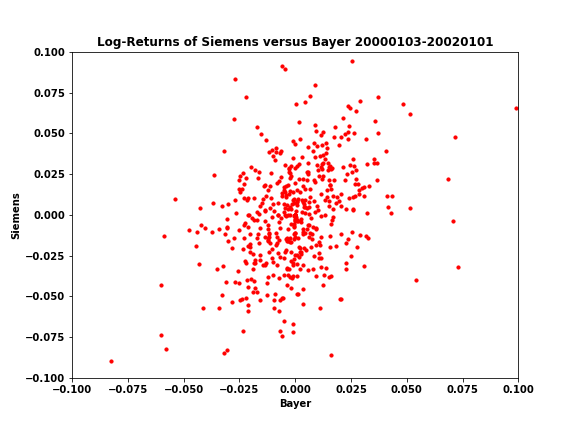
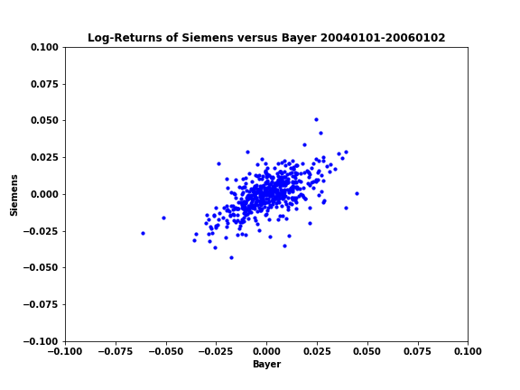

# MVAscalogret
Provides a scatterplot of daily standardized log-returns of Siemens versus Bayer.

```python
#works on numpy 1.25.2, pandas 1.5.3 and matplotlib 3.8.0
import numpy as np
import pandas as pd
import matplotlib.pyplot as plt

x2 = pd.read_csv("SIEMENS_close_99_06.dat", sep="\t", header = None)
x1 = pd.read_csv("BAYER_close_99_06.dat", sep="\t", header = None)

X = pd.DataFrame({'X1': x1.iloc[261:781, 1].values, 'X2': x2.iloc[261:781, 1].values})
X = np.log(X).diff()

plt.figure(figsize=(8, 6))
plt.scatter(X['X1'], X['X2'], c='red', marker='o', s = 10)
plt.xlabel("Bayer")
plt.ylabel("Siemens")
plt.xlim(-0.1, 0.1)
plt.ylim(-0.1, 0.1)
plt.title("Log-Returns of Siemens versus Bayer 20000103-20020101")

plt.show()

Y = pd.DataFrame({'X1': x1.iloc[1304:1825, 1].values, 'X2': x2.iloc[1304:1825, 1].values})
Y = np.log(Y).diff()

plt.figure(figsize=(8, 6))
plt.scatter(Y['X1'], Y['X2'], c='blue', marker='o', s = 10)
plt.xlabel("Bayer")
plt.ylabel("Siemens")
plt.xlim(-0.1, 0.1)
plt.ylim(-0.1, 0.1)
plt.title("Log-Returns of Siemens versus Bayer 20040101-20060102")

plt.show()
```

